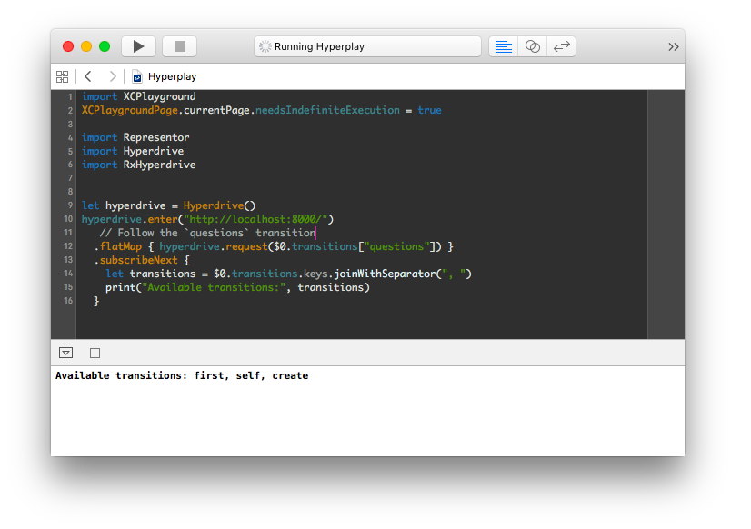

# Hyperplay

A playground for using
[Hyperdrive](https://github.com/the-hypermedia-project/Hyperdrive) to
communicate with a Hypermedia API.



## Usage

1. Recursively clone this repository and open `Hyperplay.xcworkspace` in Xcode 7.

    ```shell
    $ git clone --recursive https://github.com/kylef/Hyperplay
    $ cd Hyperplay
    $ open Hyperplay.xcworkspace
    ```

2. Click "Build" in Xcode to build the dependencies.
3. Open `Hyperplay.playground` inside the workspace.

## Notes

Hyperdrive, Representor and RxHyperdrive are added as a submodule to
allow you to easily modify and adapt on them from Hyperplay.
